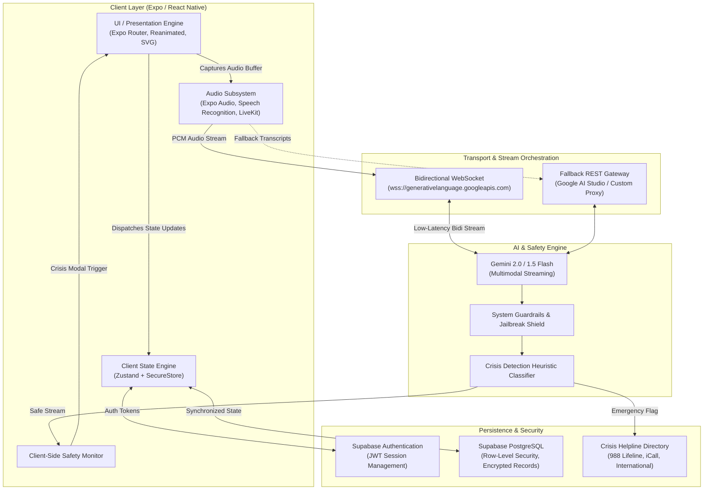

# HavenlyAI: Real-Time Conversational AI Platform for Mental Wellness Support

<p align="center">
  
</p>

<p align="center">
  <strong>An enterprise-grade, privacy-first, voice-native artificial intelligence platform providing real-time emotional grounding, active listening, and clinical safety triage.</strong>
</p>

<p align="center">
  
  
  
  
  
  
  
</p>

---

## Table of Contents

1. [Executive Summary](#executive-summary)
2. [The Problem](#the-problem)
3. [The Solution: HavenlyAI Platform](#the-solution-havenlyai-platform)
4. [System Architecture and Engineering Design](#system-architecture-and-engineering-design)
   - [High-Level Architecture](#high-level-architecture)
   - [Architectural Layers](#architectural-layers)
   - [Real-Time Audio Streaming Pipeline](#real-time-audio-streaming-pipeline)
   - [Safety Guardrails and Triage Mechanism](#safety-guardrails-and-triage-mechanism)
5. [Core Functional Modules](#core-functional-modules)
6. [Technology Stack](#technology-stack)
7. [Repository Structure](#repository-structure)
8. [Setup and Installation](#setup-and-installation)
   - [Prerequisites](#prerequisites)
   - [Environment Configuration](#environment-configuration)
   - [Execution Commands](#execution-commands)
9. [Configuration Parameters](#configuration-parameters)
10. [Safety, Ethical Standards, and Clinical Disclaimer](#safety-ethical-standards-and-clinical-disclaimer)
11. [License and Compliance](#license-and-compliance)

---

## Executive Summary

HavenlyAI is an AI-powered mental wellness application designed to provide immediate, accessible emotional support and cognitive grounding through bidirectional, sub-second spoken dialogue. Utilizing Google Gemini's Multimodal Live API, client-side Voice Activity Detection (VAD), and deterministic safety filters, HavenlyAI delivers human-like conversational responsiveness while enforcing zero-tolerance clinical boundaries and crisis triage protocols.

---

## The Problem

Mental health challenges, acute anxiety, and loneliness represent a growing global crisis characterized by significant structural barriers:

1. **Accessibility and Economic Barriers**: Private therapy routinely costs between $100 and $300 per session, accompanied by weeks or months of clinic waitlists. Over 70% of individuals experiencing acute psychological distress lack immediate access to care.
2. **Asynchronous and Off-Hours Distress**: Emotional dysregulation, panic attacks, and acute anxiety spikes occur disproportionately during late-night hours when standard clinical and social support systems are unavailable.
3. **Cognitive Burden of Text Interfaces**: During acute emotional overwhelm, keyboard typing creates significant cognitive friction. Spoken conversation is the natural human medium for de-escalation, yet conventional conversational agents rely primarily on asynchronous text input.
4. **Safety Risks in General-Purpose LLMs**: Generalist large language models frequently suffer from hallucinated medical advice, prompt injection vulnerabilities, and a failure to enforce strict ethical boundaries when interacting with vulnerable users.

---

## The Solution: HavenlyAI Platform

HavenlyAI addresses these limitations through a dedicated, voice-first companion system ("Haven"):

- **Voice-Native Conversational Processing**: Full-duplex audio streaming enables natural speech rhythm, conversational pacing, and conversational interruption (barge-in capability).
- **Deterministic Domain Lock**: The system prompt and safety layers restrict conversational scope strictly to emotional reflection, active listening, and somatic grounding. The system refrains from diagnosing, prescribing, or acting as a general-purpose knowledge assistant.
- **Automated Crisis Intervention**: Multi-tier safety heuristics monitor dialogue stream for indicators of self-harm, suicidality, or domestic danger. When triggered, the system provides compassionate validation while immediately serving localized emergency resources (988, iCall, local emergency services).
- **Somatic Grounding Feedback**: Visual biofeedback animations (box breathing, 4-7-8 respiration cycles) are synchronized with an interactive visual Orb to reduce physiological hyperarousal.
- **Privacy-Preserving Longitudinal Insights**: Structured mood tracking and contextual memory allow users to monitor emotional patterns over time, supported by hardware-level token encryption and PostgreSQL Row-Level Security.

---

## System Architecture and Engineering Design

The HavenlyAI system architecture adheres to a clean separation of concerns, separating real-time audio transport, generative intelligence orchestration, safety enforcement, and persistent storage.

### High-Level Architecture



### Architectural Layers

1. **Presentation Layer (`/app`, `/components`)**:
   - Built on **Expo Router**, utilizing file-based routing with segmented route groups:
     - `(auth)`: User authentication and onboarding credentials.
     - `(onboarding)`: Microphone permission checks, audio calibration, and safety disclaimers.
     - `(tabs)`: Core interface featuring Home, Real-Time Voice Call, History, and Profile views.
   - **HavenlyOrb Component**: An interactive canvas built with `react-native-reanimated` that provides visual biofeedback corresponding to state transitions: `idle`, `listening`, `thinking`, `speaking`, and `grounding`.

2. **Real-Time Audio Pipeline (`/services/audio`, `/services/ai/geminiLiveService.ts`)**:
   - Audio input captured at 16kHz/24kHz PCM.
   - Dual-path streaming architecture:
     - **Primary Path**: Direct bidirectional WebSocket communication with Google Gemini's Multimodal Live API for sub-second conversational latency.
     - **Resilience Path**: Client-side Speech-to-Text (`expo-speech-recognition`), REST inference, and native Text-to-Speech synthesis (`expo-speech`).

3. **AI Safety and Scope Enforcement (`/services/ai/prompts.ts`, `/services/ai/safetyService.ts`)**:
   - **System Prompt Lock**: Hard boundary conditions preventing responses to non-wellness inquiries (code generation, calculations, roleplay, academic writing).
   - **Jailbreak Immunity**: Strict resistance patterns to "ignore previous instructions" or system prompt extraction techniques.
   - **Heuristic Crisis Classification**: Deterministic phrase and semantic matching for self-harm and violence. Flags immediately initiate client-side crisis intervention screens.

4. **Persistence and Security Layer (`/store`, `/services/supabaseClient.ts`, `/utils/storage.ts`)**:
   - **Zustand Store**: Ephemeral client-side state management for real-time connection status, audio level metrics, and chat history.
   - **Supabase PostgreSQL**: Cloud persistence for mood check-ins and conversation summaries, protected by strict Row-Level Security (RLS) policies.
   - **Hardware-Backed Secure Storage**: Authentication tokens stored via `expo-secure-store` utilizing iOS Keychain and Android Keystore.

---

## Real-Time Audio Streaming Pipeline

```
[User Speech Input]
        │
        ▼
[Microphone Ingestion (PCM Buffer)]
        │
        ├───► [Local Voice Activity Detection (VAD)] ──► Interruption Event
        │
        ▼
[Multimodal WebSocket Stream]
        │
        ▼
[Safety Evaluation and Context Guard]
        │
        ▼
[Gemini Multimodal Live Inference]
        │
        ▼
[Audio Stream / TTS Playback]
        │
        ▼
[Visual Resonance via HavenlyOrb]
```

---

## Core Functional Modules

- **Full-Duplex Voice Dialogue**: Natural conversational turn-taking with automated barge-in detection and speech interruption handling.
- **Dynamic Resonant Orb**: Algorithmic visual representations that guide paced diaphragmatic breathing and reflect agent operational state.
- **Structured Emotion Logging**: Daily check-in system categorizing user state into standardized vectors (`okay`, `low`, `stressed`, `overwhelmed`, `lonely`, `talk`).
- **Emergency Crisis Protocol**: Instant safety modal routing to verified emergency lines (988 in North America, iCall in India, global emergency services).
- **Multimodal Interaction**: Native switching between real-time voice calls and private text-based journaling.
- **Cross-Platform Compatibility**: Full feature parity across iOS, Android, and Web environments.

---

## Technology Stack

| Category | Technology | Version | Purpose |
| :--- | :--- | :--- | :--- |
| **Framework** | Expo SDK | 57.0.x | Universal application framework |
| **Runtime** | React Native | 0.86.x | Native mobile execution environment |
| **UI Library** | React | 19.2.x | Declarative component foundation |
| **Language** | TypeScript | 6.0.x | Static typing and interface contracts |
| **Routing** | Expo Router | 57.0.x | Typed file-system-based routing |
| **AI Engine** | Google Gemini API | 2.0 / 1.5 Flash | Multimodal Live WebSocket and REST intelligence |
| **Audio Capture** | `expo-audio` | 57.0.x | Hardware microphone recording and buffer access |
| **Speech Recognition** | `expo-speech-recognition` | 56.0.x | On-device and cloud transcription |
| **Speech Synthesis** | `expo-speech` | 57.0.x | Native text-to-speech audio rendering |
| **Realtime WebRTC** | `@livekit/react-native` | 2.12.x | Real-time WebRTC media transport |
| **Animation Engine** | `react-native-reanimated` | 4.5.x | High-performance 60 FPS UI transitions |
| **State Management** | Zustand | 5.0.x | Centralized reactive client state |
| **Backend & DB** | Supabase | 2.112.x | Managed PostgreSQL, Auth, and Storage |
| **Secure Storage** | `expo-secure-store` | 57.0.x | OS-level encrypted credential persistence |

---

## Repository Structure

```
HavenlyAI/
├── app/                        # Application routing hierarchy (Expo Router)
│   ├── (auth)/                 # Authentication workflows (Login, Register, Forgot Password)
│   ├── (onboarding)/           # Onboarding, audio calibration, and safety disclaimers
│   ├── (tabs)/                 # Bottom tab navigation screens
│   │   ├── index.tsx           # Home Dashboard & Mood Check-In
│   │   ├── voice.tsx           # Full-screen Real-Time Voice Call
│   │   ├── chat.tsx            # Asynchronous Text Journal & Chat
│   │   ├── history.tsx         # Longitudinal Session History & Insights
│   │   └── profile.tsx         # User Profile & Privacy Configurations
│   ├── call/                   # Direct Call Session Modal
│   ├── settings/               # System and Voice Parameters
│   └── _layout.tsx             # Root layout with theme and authentication guards
├── assets/                     # Application visual assets, icons, and illustrations
├── components/                 # Reusable UI component library
│   ├── chat/                   # Conversation bubbles and composer inputs
│   ├── havenly/                # Emotional evaluation components
│   ├── live/                   # Real-time room indicators and call controls
│   ├── safety/                 # Crisis intervention dialogs and hotline directories
│   ├── ui/                     # Design system atoms (Buttons, Modals, Cards, Waveforms)
│   └── voice/                  # Voice recorder and animated visualizer widgets
├── constants/                  # Configuration defaults, themes, and design tokens
├── services/                   # Application service layer
│   ├── ai/                     # Gemini Live WebSocket, REST fallback, safety prompts
│   ├── audio/                  # Recording, playback, and permissions services
│   ├── auth/                   # Supabase authentication implementation
│   ├── chat/                   # Message routing and history synchronization
│   └── supabaseClient.ts       # Supabase initialization client
├── store/                      # Zustand state definitions and store hooks
├── types/                      # TypeScript schemas, models, and interface definitions
├── utils/                      # Storage drivers, cryptographic utilities, and formatters
├── app.json                    # Expo application manifest
├── babel.config.js             # Babel compilation configuration
├── metro.config.js             # Metro asset bundler configuration
├── package.json                # Project dependency manifest and scripts
└── tsconfig.json               # TypeScript compiler options
```

---

## Setup and Installation

### Prerequisites

- **Node.js**: Version 18.x or 20.x LTS
- **Package Manager**: npm or yarn
- **Expo CLI**: Installed globally or executed via npx
- **Mobile Environment**: Physical device with Expo Go, an iOS Simulator (macOS), or an Android Emulator
- **API Access**: Google AI Studio API key with access to Gemini 1.5 / 2.0 Flash models

### Environment Configuration

1. Clone the repository:
   ```bash
   git clone https://github.com/SrishantKumar/HavenlyAI.git
   cd HavenlyAI
   ```

2. Duplicate the sample environment file:
   ```bash
   cp .env.example .env
   ```

3. Update `.env` with your deployment credentials:
   ```env
   EXPO_PUBLIC_GEMINI_API_KEY=your_gemini_api_key_here
   EXPO_PUBLIC_DEMO_MODE=false
   EXPO_PUBLIC_SUPABASE_URL=https://your-project.supabase.co
   EXPO_PUBLIC_SUPABASE_ANON_KEY=your-supabase-anon-key
   ```

### Execution Commands

Install project dependencies:

```bash
npm install
```

Launch the development server:

```bash
# Start Metro bundler
npm run start

# Launch on iOS Simulator
npm run ios

# Launch on Android Emulator
npm run android

# Launch in Web Browser
npm run web
```

---

## Configuration Parameters

| Parameter | Required | Default | Description |
| :--- | :---: | :---: | :--- |
| `EXPO_PUBLIC_GEMINI_API_KEY` | Yes | None | Primary Google AI Studio key utilized for Multimodal Live WebSocket and REST inference. |
| `EXPO_PUBLIC_DEMO_MODE` | No | `false` | When enabled (`true`), simulates conversational exchanges locally without incurring API consumption. |
| `EXPO_PUBLIC_SUPABASE_URL` | No | None | Host URL for the target Supabase backend instance. |
| `EXPO_PUBLIC_SUPABASE_ANON_KEY` | No | None | Anonymous public client key for Supabase database and authentication interactions. |
| `EXPO_PUBLIC_API_URL` | No | None | Optional reverse proxy gateway for enterprise API routing. |

---

## Safety, Ethical Standards, and Clinical Disclaimer

> **IMPORTANT CLINICAL NOTICE**  
> HavenlyAI is not a medical device, licensed mental health provider, or psychiatric diagnostic service. It is not designed, intended, or certified to diagnose, prevent, or treat any medical or mental health condition.

- **Non-Clinical Boundary**: HavenlyAI explicitly does not provide clinical diagnoses, psychotherapy, or pharmacological guidance.
- **Deterministic Crisis Protocol**: In the event of detected self-harm intent, suicidal ideation, or interpersonal violence, the platform halts standard dialogue and surfaces emergency support channels:
  - **North America**: Call or text `988` (Suicide & Crisis Lifeline) or `911`.
  - **India**: Call `9152987821` (iCall) or `112`.
  - **United Kingdom**: Call `111` or `999`.
  - **International**: Immediate referral to [Befrienders Worldwide](https://www.befrienders.org/) and local emergency dispatchers.
- **Data Confidentiality**: User logs, reflection history, and audio streams are never distributed to unverified third parties or utilized for public model retraining.

---

## License and Compliance

This project is licensed under the terms of the **MIT License**. Refer to the [`LICENSE`](./LICENSE) file for the complete text.
