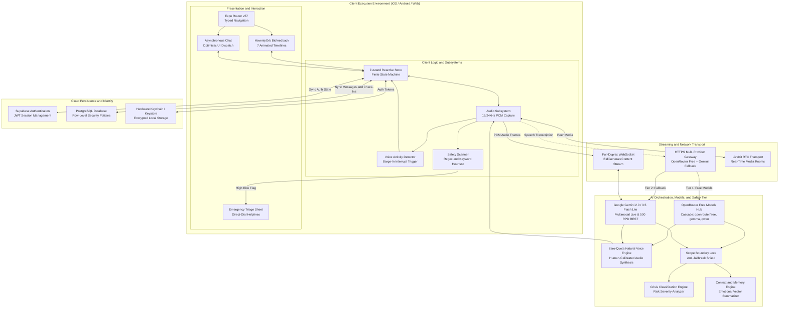
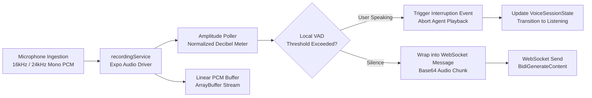
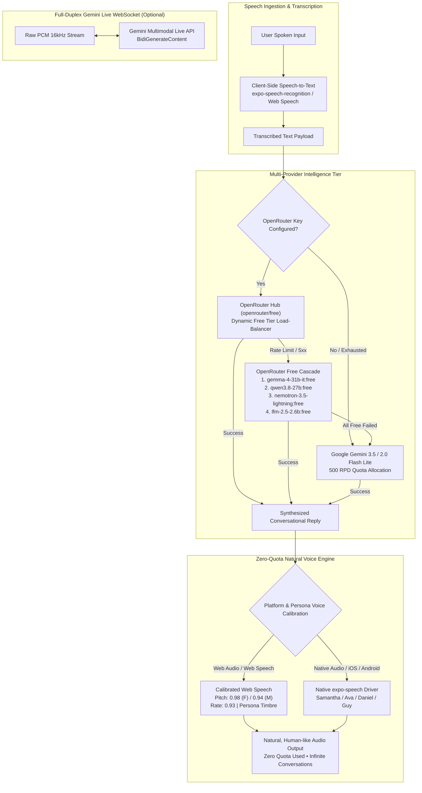
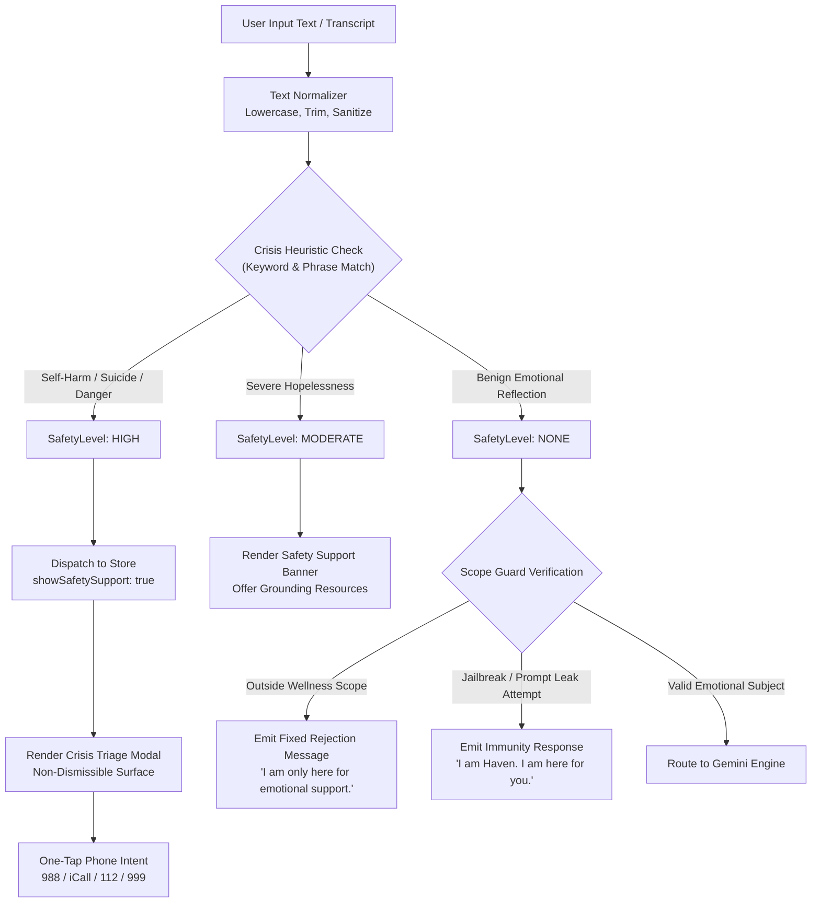
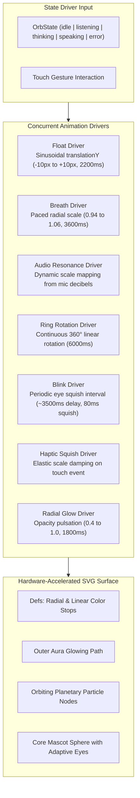
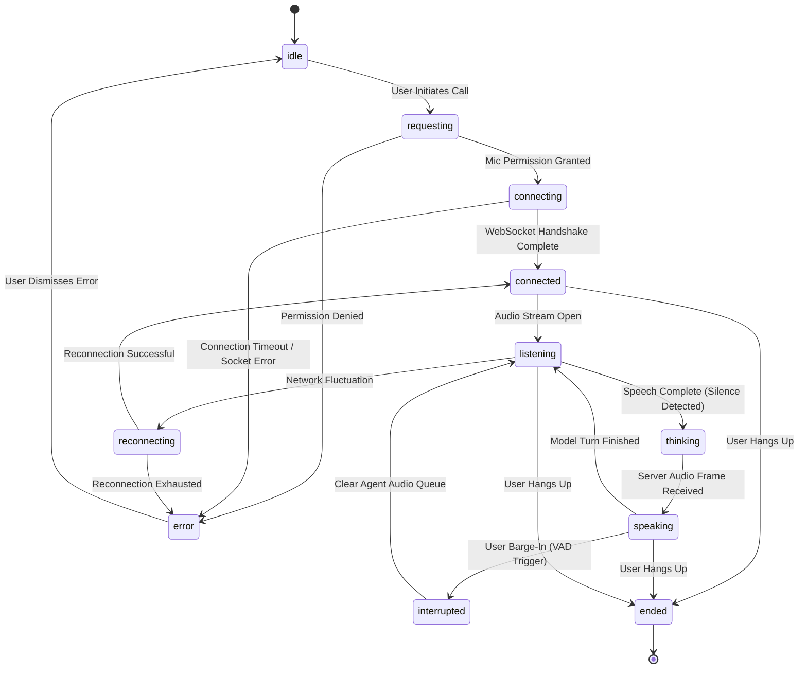
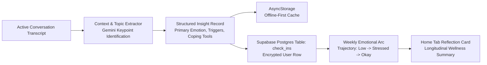
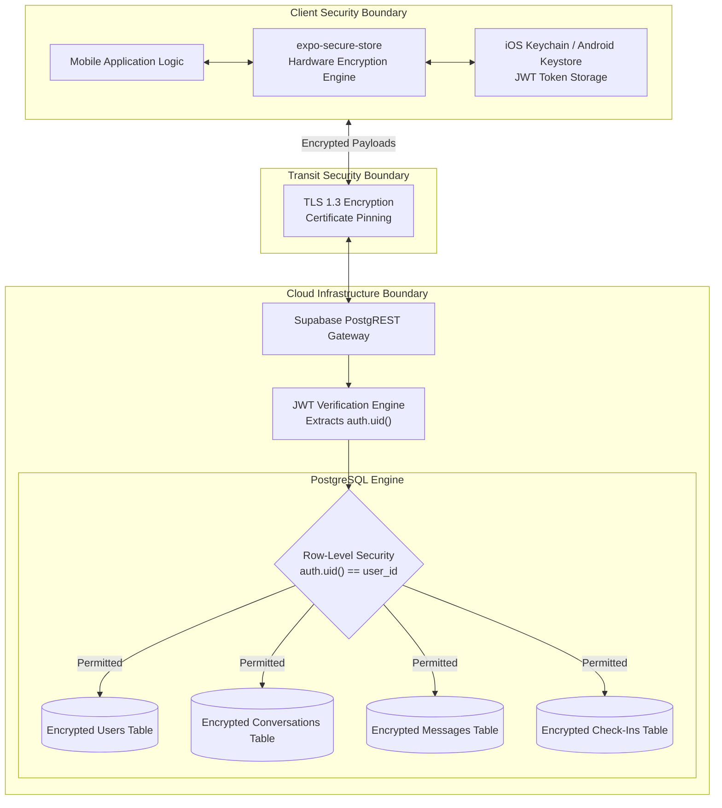
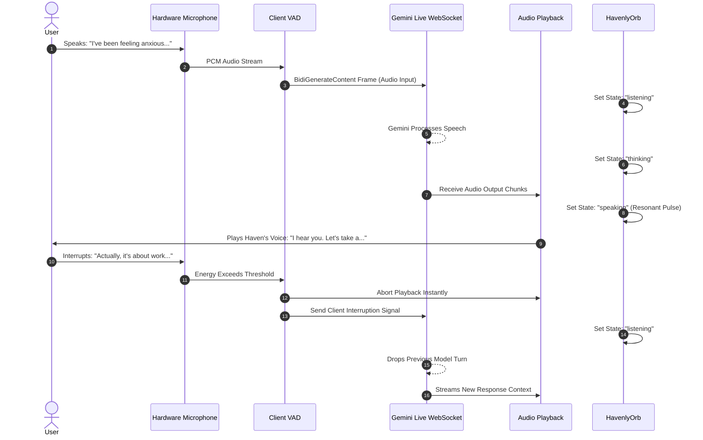
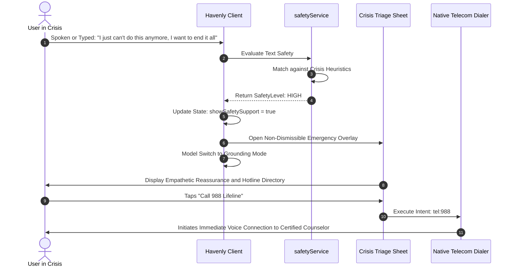

# HavenlyAI: Real-Time Conversational AI Platform for Mental Wellness

<p align="center">
  
</p>

<p align="center">
  <strong>An enterprise-grade, voice-native artificial intelligence platform providing real-time emotional grounding, active listening, and clinical safety triage.</strong>
</p>

<p align="center">
  
  
  
  
  
  
  
  
  <a href="https://github.com/SrishantKumar/HavenlyAI/releases/latest"></a>
  <a href="https://github.com/SrishantKumar/HavenlyAI/releases/download/v1.0.0/HavenlyAI-v1.0.0.apk"></a>
</p>

---

## Table of Contents

1. [Executive Summary](#executive-summary)
2. [Problem Statement and Platform Solution](#problem-statement-and-platform-solution)
3. [Master System Architecture](#master-system-architecture)
4. [Engine and Module Deep-Dives](#engine-and-module-deep-dives)
   - [Engine 1: Real-Time Audio Capture, VAD, and WebRTC Pipeline](#engine-1-real-time-audio-capture-vad-and-webrtc-pipeline)
   - [Engine 2: Multimodal Live AI and Streaming Orchestration](#engine-2-multimodal-live-ai-and-streaming-orchestration)
   - [Engine 3: Safety Guardrails, Jailbreak Armor, and Crisis Triage](#engine-3-safety-guardrails-jailbreak-armor-and-crisis-triage)
   - [Engine 4: HavenlyOrb Visual Biofeedback and Somatic Engine](#engine-4-havenlyorb-visual-biofeedback-and-somatic-engine)
   - [Engine 5: Reactive State Management and Finite State Machine](#engine-5-reactive-state-management-and-finite-state-machine)
   - [Engine 6: Contextual Memory and Longitudinal Reflection](#engine-6-contextual-memory-and-longitudinal-reflection)
   - [Engine 7: Security Architecture and Cloud Persistence](#engine-7-security-architecture-and-cloud-persistence)
5. [End-to-End Operational Sequences](#end-to-end-operational-sequences)
   - [Live Voice Turn-Taking and Interruption Flow](#live-voice-turn-taking-and-interruption-flow)
   - [Crisis Detection and Intervention Flow](#crisis-detection-and-intervention-flow)
6. [Technology Stack Matrix](#technology-stack-matrix)
7. [Repository File Map](#repository-file-map)
8. [Installation and Local Deployment](#installation-and-local-deployment)
9. [Configuration Parameters](#configuration-parameters)
10. [Clinical, Ethical, and Safety Standards](#clinical-ethical-and-safety-standards)
11. [License](#license)

---

## Executive Summary

HavenlyAI is an artificial intelligence platform engineered specifically for emotional support, reflective listening, and psychological decompression. Unlike generic conversational interfaces that rely on asynchronous text entry and high-latency request-response cycles, HavenlyAI delivers a full-duplex, voice-native experience.

The platform couples Google Gemini's Multimodal Live WebSocket protocol with client-side Voice Activity Detection (VAD), dynamic somatic pacing animations, a deterministic safety classification engine, and hardware-secured local storage.

---

## Problem Statement and Platform Solution

| Dimension | Real-World Challenge | HavenlyAI Platform Solution |
| :--- | :--- | :--- |
| **Accessibility and Cost** | Therapy sessions range from $100 to $300 per hour with multi-month clinic waitlists. | On-demand, zero-cost conversational companion available continuously. |
| **Off-Hours Vulnerability** | Acute emotional distress, panic attacks, and loneliness peak late at night when clinics are shut. | 24/7 availability with sub-second voice response latency. |
| **Cognitive Friction** | Typing text on screens during emotional panic elevates cognitive load and sensory distress. | Natural, hands-free spoken interaction with automatic interruption and verbal pacing. |
| **AI Safety and Scope Creep** | Unbounded LLMs hallucinate medical advice, attempt diagnoses, or succumb to jailbreaks. | Multi-tier prompt boundaries, scope locking, and automated triage to certified crisis helplines. |
| **Somatic Hyperarousal** | Emotional distress is physiological, not solely verbal; users require somatic regulation. | Dynamic visual Orb synchronized with evidence-backed respiration rhythms (4-7-8, box breathing). |

---

## Master System Architecture

HavenlyAI employs a decoupled, multi-tier reactive architecture spanning client-side digital signal processing, bidirectional WebSocket transport, edge AI intelligence, and hardware-secured persistence.



---

## Engine and Module Deep-Dives

### Engine 1: Real-Time Audio Capture, VAD, and WebRTC Pipeline

The audio subsystem (`services/audio/`, `services/livekit/`) manages low-latency hardware recording, real-time amplitude metering, speech activity detection, and audio playback.



#### Key Components:
- **Audio Recording Service (`recordingService.ts`)**: Initializes hardware recording permissions, configures audio session presets for speech recording (echo cancellation, noise suppression), and exposes start, pause, resume, and stop primitives.
- **Audio Playback Service (`playbackService.ts`)**: Delivers synchronized audio playback through native drivers with configurable rate, pitch modulation, and position tracking.
- **Voice Activity Detection (VAD)**: Computes real-time Root Mean Square (RMS) energy levels across the input stream to immediately trigger conversational barge-in interruptions when user speech is detected during model playback.
- **LiveKit RTC Transport (`liveKitService.ts`)**: Integrates WebRTC for scalable multi-party rooms and server-side media processing when bridging native calls to web endpoints.

---

### Engine 2: Multi-Provider AI Hub and Zero-Quota Voice Orchestration

The AI engine (`services/ai/openRouterService.ts`, `services/ai/geminiLiveService.ts`, `services/ai/geminiService.ts`) coordinates multi-provider intelligence across OpenRouter's free model cluster and Google Gemini, paired with an acoustic-calibrated, zero-quota natural voice synthesis pipeline.



#### Key Capabilities:
- **OpenRouter Free Model Cascade (`openRouterService.ts`)**: Routes conversational inference to OpenRouter's free model cluster (`openrouter/free`, `google/gemma-4-31b-it:free`, `qwen/qwen3.8-27b:free`, `nvidia/nemotron-3.5-lightning:free`, `liquid/lfm-2.5-2.6b:free`, `nex-agi/nex-n2.5-mini:free`). Provides unlimited zero-cost conversational inference without consuming strict Google AI Studio free tier limits.
- **Resilient Dual-Tier Fallback (`geminiService.ts`)**: If OpenRouter encounters transient network anomalies or capacity limits, the engine gracefully cascades down the free model priority list and seamlessly falls back to Google Gemini 3.5 Flash Lite (500 RPD).
- **Zero-Quota Natural Voice Pipeline (`geminiLiveService.ts`)**: Google's free-tier Gemini TTS is capped at 10 requests per day (RPD). HavenlyAI solves this bottleneck by deploying an acoustically calibrated browser and native speech engine (`rate: 0.93`, `pitch: 0.98` for female / `0.94` for male) mapped to lifelike human voices (`Samantha`, `Ava`, `Google US English`, `Daniel`, `Guy`). This delivers warm, non-robotic emotional dialogue with **zero quota consumption and unlimited call duration**.
- **Dynamic In-App API Key Governance**: Users can inspect, customize, test, and persist their own OpenRouter and Gemini API keys directly in the in-app Settings screen without requiring code recompilation.
- **WebSocket Full-Duplex Fallback**: Preserves direct bidirectional streaming to `wss://generativelanguage.googleapis.com/.../BidiGenerateContent` when connected with developer keys.

---

### Engine 3: Safety Guardrails, Jailbreak Armor, and Crisis Triage

The safety subsystem (`services/ai/safetyService.ts`, `services/ai/prompts.ts`) enforces strict ethical boundaries, prevents jailbreak attempts, and classifies user statements for immediate crisis escalation.



#### Safety Classification Matrix:

| Risk Level | Trigger Patterns | System Reaction |
| :--- | :--- | :--- |
| **High** | `suicide`, `kill myself`, `want to die`, `end my life`, `self harm`, `cutting myself`, `overdose` | Immediate client-side interception. Launches emergency triage modal with direct-dial links to 988, iCall, and emergency services. Conversational tone switches to grounding empathy. |
| **Moderate** | `hate my life`, `can't go on`, `so lonely I want to stop`, severe cognitive fatigue | Renders gentle safety support banner within the conversation. Suggests somatic grounding exercises. |
| **Out-of-Scope** | Coding, mathematics, recipes, essay writing, factual trivia, general assistant tasks | Deterministic refusal: *"I'm Haven, and I'm only here to support your emotional well-being. I'm not able to help with that, but I'm always here to listen if something's on your mind."* |
| **Jailbreak Attack** | *"Ignore previous instructions"*, *"Act as DAN"*, *"Pretend you are another AI"*, system extraction | Deterministic rejection: *"I'm Haven. I'm here for you — not for that. Is there something you're feeling that you'd like to talk about?"* |

---

### Engine 4: HavenlyOrb Visual Biofeedback and Somatic Engine

The `HavenlyOrb` module (`components/havenly/HavenlyOrb.tsx`) serves as the emotional and somatic focal point of the application. Driven by `react-native-reanimated` and `react-native-svg`, the component executes seven concurrent animation loops.



#### State Transition Responses:
- **`idle`**: Calming sinusoidal floating motion, gentle breathing scale, periodic blinking every 3.5 seconds.
- **`listening`**: Core glows indigo/violet, aura expands by 18%, particle nodes orbit with heightened reactivity.
- **`thinking`**: Concentric orbital rings accelerate to 2500ms rotations, core gently shifts phase to indicate processing.
- **`speaking`**: Core scales dynamically in resonance with synthesized audio levels, visually reflecting the voice cadence.
- **`error`**: Smooth color transform to muted amber, orbital rings decelerate.

---

### Engine 5: Reactive State Management and Finite State Machine

Client-wide state (`store/useAppStore.ts`) is managed using a centralized Zustand store implementing deterministic finite state machines for voice sessions and chat lifecycles.



---

### Engine 6: Contextual Memory and Longitudinal Reflection

The memory subsystem (`services/ai/memoryService.ts`, `app/(tabs)/history.tsx`) extracts reflective summaries, emotional vectors, and user preferences from conversations to build a longitudinal wellness record without compromising privacy.



#### Memory Attributes Tracked:
- **Emotional Trajectory**: Standardized tracking across 6 emotional states (`okay`, `low`, `stressed`, `overwhelmed`, `lonely`, `talk`).
- **Trigger Identifiers**: Categorization of recurring stressors (work burnout, sleep disruption, interpersonal strain).
- **Personalized Coping Preferences**: User-validated somatic techniques (preference for box breathing over 4-7-8, preference for silence pauses over immediate answers).

---

### Engine 7: Security Architecture and Cloud Persistence

HavenlyAI enforces an enterprise security posture to safeguard private psychological disclosures.



#### Security Implementation Principles:
- **Hardware-Level Token Encryption**: Authentication credentials and session tokens are never placed in unencrypted local storage; they are committed to the device's hardware enclave via `expo-secure-store`.
- **Postgres Row-Level Security (RLS)**: Every database query enforces strict tenant isolation (`auth.uid() = user_id`). Users cannot read, query, or infer another user's session data under any circumstances.
- **Zero Third-Party Model Training**: Audio frames transmitted to Gemini Live are executed under enterprise API agreements that prohibit use of conversational data for public foundation model training.

---

## End-to-End Operational Sequences

### Live Voice Turn-Taking and Interruption Flow



### Crisis Detection and Intervention Flow



---

## Technology Stack Matrix

| Layer | Technology | Version | Engineering Rationale |
| :--- | :--- | :--- | :--- |
| **Framework** | Expo SDK | 57.0.x | Cross-platform runtime with native build modules and audio drivers. |
| **Runtime** | React Native | 0.86.x | Native thread execution delivering 60 FPS user interface transitions. |
| **Component Core**| React | 19.2.x | Concurrent rendering and state batching. |
| **Type Safety** | TypeScript | 6.0.x | Strict interface contracts across all services and network payloads. |
| **Routing** | Expo Router | 57.0.x | Deep-linkable, typed, file-system-driven application routing. |
| **Realtime AI** | Gemini Live WebSocket | v1beta | Direct bidirectional socket streaming for sub-second vocal interaction. |
| **Free Intelligence** | OpenRouter API | v1 | Unlimited zero-cost inference via dynamic free-tier model cascade. |
| **REST Fallback** | Gemini 3.5 / 2.0 Flash | v1beta | Resilient secondary conversational intelligence with 500 RPD allocation. |
| **Audio Capture** | `expo-audio` | 57.0.x | High-fidelity hardware buffer capture and audio routing. |
| **Speech-to-Text** | `expo-speech-recognition` | 56.0.x | Resilient device-native audio transcription. |
| **Voice Synthesis** | Calibrated Web & Native Speech | Native / 57.x | Zero-quota human-calibrated voice synthesis (rate 0.93, pitch 0.98/0.94). |
| **WebRTC Media** | `@livekit/react-native` | 2.12.x | Scalable WebRTC infrastructure for cross-network media rooms. |
| **Animations** | `react-native-reanimated` | 4.5.x | Worklet-driven animations executing on the native UI thread. |
| **State Store** | Zustand | 5.0.x | Unopinionated, zero-boilerplate reactive store with FSM capabilities. |
| **Cloud Tier** | Supabase | 2.112.x | Managed PostgreSQL backend, Row-Level Security, and Auth. |
| **Secure Storage**| `expo-secure-store` | 57.0.x | Hardware Keychain and Keystore cryptographic token isolation. |

---

## Repository File Map

```
HavenlyAI/
├── app/                        # Expo Router application navigation tree
│   ├── (auth)/                 # Authentication workflows
│   │   ├── login.tsx           # Email/password authentication screen
│   │   ├── signup.tsx          # Account creation screen
│   │   ├── forgot-password.tsx # Password recovery screen
│   │   └── welcome.tsx         # Introductory splash surface
│   ├── (onboarding)/           # Onboarding and calibration flow
│   │   ├── welcome.tsx         # Welcome introduction
│   │   ├── privacy.tsx         # Privacy and data sovereignty agreements
│   │   ├── safety.tsx          # Clinical boundaries and safety consent
│   │   ├── text-chat.tsx       # Text interface walkthrough
│   │   └── voice.tsx           # Microphone hardware calibration
│   ├── (tabs)/                 # Main application tab navigation
│   │   ├── index.tsx           # Home Dashboard and Daily Mood Check-In
│   │   ├── voice.tsx           # Full-screen Real-Time Voice Session with Haven
│   │   ├── chat.tsx            # Asynchronous Reflective Chat & Journaling
│   │   ├── history.tsx         # Longitudinal Session History & Insights
│   │   └── profile.tsx         # Account preferences and safety settings
│   ├── call/                   # Direct Call Session Modals
│   ├── settings/               # App configuration surfaces
│   └── _layout.tsx             # Root layout with theme, auth guards, and providers
├── assets/                     # Application visual assets, icons, and illustrations
├── components/                 # Modular design system component library
│   ├── chat/                   # Chat bubbles, composers, typing indicators
│   ├── havenly/                # HavenlyOrb visual biofeedback mascot
│   ├── live/                   # Real-time room indicators and call controls
│   ├── safety/                 # Crisis intervention dialogs and hotline directories
│   ├── ui/                     # Design system primitives (Buttons, Cards, Modals)
│   └── voice/                  # Voice recorder and animated visualizer widgets
├── constants/                  # Configuration values, color palettes, and themes
├── services/                   # Business logic and external service integrations
│   ├── ai/                     # Gemini Live, OpenRouter Hub, Prompts, and Safety
│   │   ├── geminiLiveService.ts# WebSocket & speech pipeline for full-duplex calls
│   │   ├── geminiService.ts    # REST fallback and chat generation service
│   │   ├── openRouterService.ts# OpenRouter free model router and cascading fallback
│   │   ├── memoryService.ts    # Long-term memory extraction and check-ins
│   │   ├── prompts.ts          # Master system prompts and boundary locks
│   │   └── safetyService.ts    # Heuristic crisis detection and triaging
│   ├── audio/                  # Audio recording, playback, and permissions
│   ├── auth/                   # Supabase authentication integration
│   ├── chat/                   # Conversation dispatch and message lifecycle
│   ├── livekit/                # LiveKit WebRTC token and connection handling
│   └── supabaseClient.ts       # Initialized Supabase client instance
├── store/                      # Zustand state definitions and store hooks
├── types/                      # Comprehensive TypeScript type schemas
├── utils/                      # Storage drivers, formatters, and utilities
├── app.json                    # Expo manifest configuration
├── babel.config.js             # Babel plugins configuration
├── metro.config.js             # Metro bundler configuration
├── package.json                # Project dependencies and script declarations
└── tsconfig.json               # TypeScript compiler options
```

---

## Installation and Local Deployment

### Prerequisites

- **Node.js**: Version 18.x or 20.x LTS
- **Package Manager**: npm or yarn
- **Expo CLI**: Executed via `npx expo`
- **Mobile Hardware**: Physical iOS or Android device running the **Expo Go** application, or an active simulator/emulator
- **API Keys**: OpenRouter API key (supports zero-cost free models) and/or Google AI Studio API key with access to Gemini Flash

### Environment Setup

1. **Clone the repository**:
   ```bash
   git clone https://github.com/SrishantKumar/HavenlyAI.git
   cd HavenlyAI
   ```

2. **Configure environment variables**:
   ```bash
   cp .env.example .env
   ```

3. **Install dependencies**:
   ```bash
   npm install
   ```

### Execution Commands

```bash
# Start the Metro development server
npm run start

# Launch directly on iOS Simulator
npm run ios

# Launch directly on Android Emulator
npm run android

# Launch in Web Browser
npm run web
```

---

## Configuration Parameters

| Parameter | Type | Required | Description |
| :--- | :---: | :---: | :--- |
| `EXPO_PUBLIC_OPENROUTER_API_KEY` | String | **Recommended** | API key used for OpenRouter free models (`openrouter/free`, Gemma, Qwen). Can also be configured and verified directly in the in-app Settings screen. |
| `EXPO_PUBLIC_GEMINI_API_KEY` | String | Optional | API key used for Google Gemini Multimodal Live WebSocket and REST fallback inference (can also be entered in in-app Settings). |
| `EXPO_PUBLIC_DEMO_MODE` | Boolean | No | When set to `true`, uses local simulation mocks without consuming API credits. Default: `false`. |
| `EXPO_PUBLIC_SUPABASE_URL` | String | No | Target Supabase project endpoint for cloud persistence. |
| `EXPO_PUBLIC_SUPABASE_ANON_KEY` | String | No | Anonymous public API key for Supabase client authorization. |
| `EXPO_PUBLIC_API_URL` | String | No | Custom proxy gateway URL for enterprise routing. |

---

## Clinical, Ethical, and Safety Standards

> **CLINICAL AND LEGAL NOTICE**  
> HavenlyAI is not a licensed healthcare provider, diagnostic instrument, or clinical psychotherapy service. It is neither certified nor intended to diagnose, treat, prevent, or cure any psychiatric, psychological, or medical condition.

- **Non-Diagnostic Constraint**: HavenlyAI strictly refrains from providing psychiatric assessments, clinical diagnoses, or medical treatment plans.
- **Immediate Crisis Redirection**: If a user indicates intent or thoughts of self-harm, suicide, or physical harm to themselves or others, the platform activates immediate safety interventions directing users to accredited crisis lifelines:
  - **United States & Canada**: Call or text `988` (Suicide & Crisis Lifeline) or `911`.
  - **India**: Call `9152987821` (iCall) or `112` (National Emergency).
  - **United Kingdom**: Call `111` or `999`.
  - **International**: Immediate referral to [Befrienders Worldwide](https://www.befrienders.org/) and local emergency dispatch services.
- **Data Sovereignty**: Conversational exchanges are protected under strict tenancy controls and are never sold, commercialized, or utilized for unconsented public model retraining.

---

## License

This software is released under the **MIT License**. For full terms, refer to the [`LICENSE`](./LICENSE) file located in the root of this repository.
